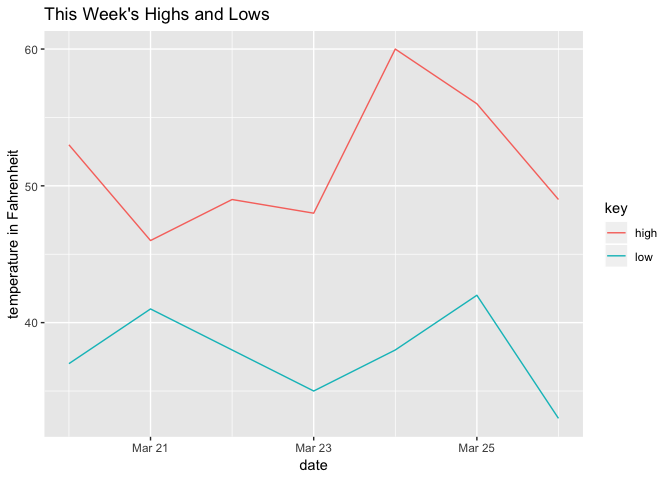

temperature
================
Joyce Robbins
3/31/2019

## This Week’s Temperature in New York 2019

``` r
library(tidyverse)
```

    ## ── Attaching packages ─────────────── tidyverse 1.2.1 ──

    ## ✔ ggplot2 3.1.0          ✔ purrr   0.3.2     
    ## ✔ tibble  2.0.1          ✔ dplyr   0.8.0     
    ## ✔ tidyr   0.8.3.9000     ✔ stringr 1.4.0     
    ## ✔ readr   1.3.1          ✔ forcats 0.4.0.9000

    ## ── Conflicts ────────────────── tidyverse_conflicts() ──
    ## ✖ dplyr::filter() masks stats::filter()
    ## ✖ dplyr::lag()    masks stats::lag()

``` r
df <- tibble(date = as.Date("2019-03-20") + (0:6),
                 low = c(37, 41, 38, 35, 38, 42, 33),
                 high = c(53, 46, 49, 48, 60, 56, 49)) %>% 
  gather(key, value, -date)

ggplot(df, aes(date, value, color = key)) + geom_line() + ggtitle("This Week's Highs and Lows") +
  ylab("temperature in Fahrenheit")
```

<!-- -->
